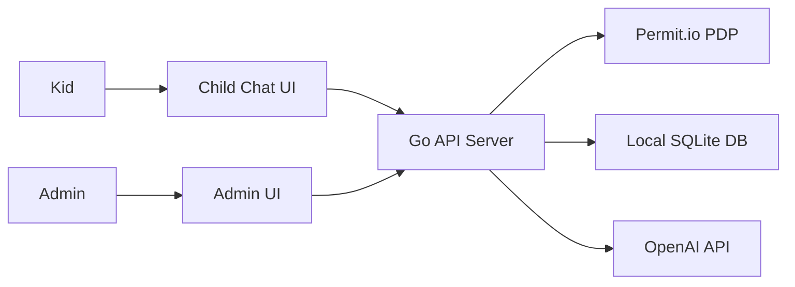

# RBAC Database Control for AI Usage

A Go application demonstrating fine-grained, policy-driven AI access to sensitive data using [Permit.io](https://permit.io) and OpenAI's GPT-4 API.
Supports an approval workflow for AI actions and enforces table/row/column-level permissions via externalized RBAC.

---

## Architecture

---

## Getting Started

### 1. Clone & Install

```bash
git clone https://github.com/schoolboylurk/data-sentinel.git
cd data-sentinel
go mod download
```

### 2. Set Environment Variables
Unix/macOS
```bash
export DB_PATH="./data.db"
export DB_SCHEMA="./pkg/database/schema.sql"
export OPENAI_API_KEY="<your_openai_api_key>"
export PERMIT_API_KEY="<your_permit_api_key>"
export PERMIT_PDP_URL="<your_permit_pdp_url>"
export SESSION_SECRET="<your_session_secret>"
export COOKIE_DOMAIN="localhost"  # or your domain
```
Windows (PowerShell)
```powershell
setx DB_PATH ".\data.db"
setx DB_SCHEMA ".\pkg\database\schema.sql"
setx OPENAI_API_KEY "<your_openai_api_key>"
setx PERMIT_API_KEY "<your_permit_api_key>"
setx PERMIT_PDP_URL "<your_permit_pdp_url>"
setx SESSION_SECRET "<your_session_secret>"
setx COOKIE_DOMAIN "localhost"
```

### 3. Initialize & Run
```bash
# default
go run ./cmd/main.go
```

```bash
# or override
PORT=3000 go run ./cmd/main.go
```
---
## Authorization Setup (Permit.io)
Define your roles & permissions. Example policy JSON:
```json
{
  "roles": [
    {
      "name": "parent",
      "permissions": [
        "kids.manage",
        "prompt_requests.approve"
      ]
    },
    {
      "name": "child",
      "permissions": [
        "prompt_requests.create",
        "prompt_requests.view"
      ]
    },
    {
      "name": "ai-agent",
      "permissions": [
        "prompt_requests.process"
      ]
    }
  ]
}
```
Load with the Permit CLI:
```bash
permit policy apply roles.json
permit group create parents
permit group add parents alice_parent
permit group create kids
permit group add kids bob_kid
```
---
## Testing Scenarios
1. Child submits (`POST /request-prompt`) -> `{ "request_id": 1, "status": "pending" }`
2. Parent approves (`POST /approve/1?username=alice_parent`) -> AI answer in JSON
3. Direct processing (`POST /generate-report`) -> instant AI answer
4. Unauthorized -> HTTP 403
---
## Why Externalized Authorization?
- **Separation of Concerns:** No hardcoded `if` statements sprawled through your code.
- **Flexibility:** Change policies in Permit.io without the need to redeploy or change database schema.
- **Auditability:** Centralized logs of every permission check.
- **Compliance-ready:** Enforce least privilege at table/row/column level.
---
## Container (Optional)
A hardened Chainguard Go runtime is recommended. 

Use a multi-stage build with Chainguard’s Go builder and Debian Bullseye slim base for a minimal, secure image. Example `Dockerfile`:
```dockerfile
# ─── 1) Builder Stage ────────────────────────────────────────────
FROM chainguard/go:latest AS builder

WORKDIR /app

# Download deps
COPY go.mod go.sum ./
RUN go mod download

# Build static, stripped binary
COPY . .
RUN CGO_ENABLED=0 GOOS=linux \
    go build -ldflags="-s -w" -o /usr/local/bin/ai-app ./cmd

# ─── 2) Runtime Stage ────────────────────────────────────────────
FROM debian:bullseye-slim

# install certs + curl + jq
RUN apt-get update && apt-get install -y --no-install-recommends \
      ca-certificates curl jq \
    && rm -rf /var/lib/apt/lists/*

# Copy the compiled binary
COPY --from=builder /usr/local/bin/ai-app /usr/local/bin/ai-app

# Copy HTML templates & static assets
COPY --from=builder /app/web/templates /app/web/templates
COPY --from=builder /app/web/static    /app/web/static

WORKDIR /app

# Default env vars (override in your host/CI)
ENV DB_PATH="./data.db" \
    DB_SCHEMA="./pkg/database/schema.sql" \
    OPENAI_API_KEY="" \
    PERMIT_API_KEY="" \
    PERMIT_PDP_URL="" \
    SESSION_SECRET="" \
    COOKIE_DOMAIN="localhost" \
    PORT=${PORT:-8080}

EXPOSE 8080

# Healthcheck for orchestrators
HEALTHCHECK --interval=30s --timeout=5s \
  CMD curl -f http://localhost:${PORT}/health || exit 1

ENTRYPOINT ["/usr/local/bin/ai-app"]
```
Build and run locally:
```bash
# Build the Docker image
docker build -t data-sentinel .

# Run with all required env vars
docker run -it --rm \
  -e DB_PATH="./data.db" \
  -e DB_SCHEMA="./pkg/database/schema.sql" \
  -e OPENAI_API_KEY="<your_openai_api_key>" \
  -e PERMIT_API_KEY="<your_permit_api_key>" \
  -e PERMIT_PDP_URL="<your_permit_pdp_url>" \
  -e SESSION_SECRET="<your_session_secret>" \
  -e COOKIE_DOMAIN="localhost" \
  -p 8080:8080 \
  data-sentinel
```
---
## Seeding the Database
```sql
sqlite3 ${DB_PATH} < ${DB_SCHEMA}
sqlite3 ${DB_PATH} <<'SQL'
INSERT OR IGNORE INTO kids(username,age) VALUES('newuser',10);
INSERT OR IGNORE INTO content_policies(kid_username,allowed,restricted)
  VALUES('newuser','math,science','violence');
SQL
```
---
## Deployment
I am running this on Railway which integrates well with GitHub.
1. Pull repo and push to Railway.
2. Select "Deploy from GitHub" and point to your Dockkerfile.
3. In Settings -> Variables, add your `OPENAI_API_KEY`, `PERMIT_API_KEY`, `PERMIT_PDP_URL`, `SESSION_SECRET`, and `COOKIE_DOMAIN`.
4. Railway will auto-inject `PORT` for you.

## Testing Examples:
```bash
# create a chat session
curl -X POST http://localhost:8080/child/session \
  -H "Content-Type: application/json" \
  -d '{"content":"Hello"}'

# post message & get history
curl -X POST http://localhost:8080/child/session/1/message \
  -H "Content-Type: application/json" \
  -d '{"content":"Tell me a joke"}'

curl http://localhost:8080/child/session/1/history
```
---
## Known Limitations
- Tokens are not budgeted—unlimited prompts may exhaust your OpenAI quota.

- No persistence beyond the local SQLite file.

- Current database is completely ephemeral, for more long lasting implementations please consider leveraging Postgres/MySQL. This is something I'm looking at implementing in a future update.
---
## License
[MIT]()
